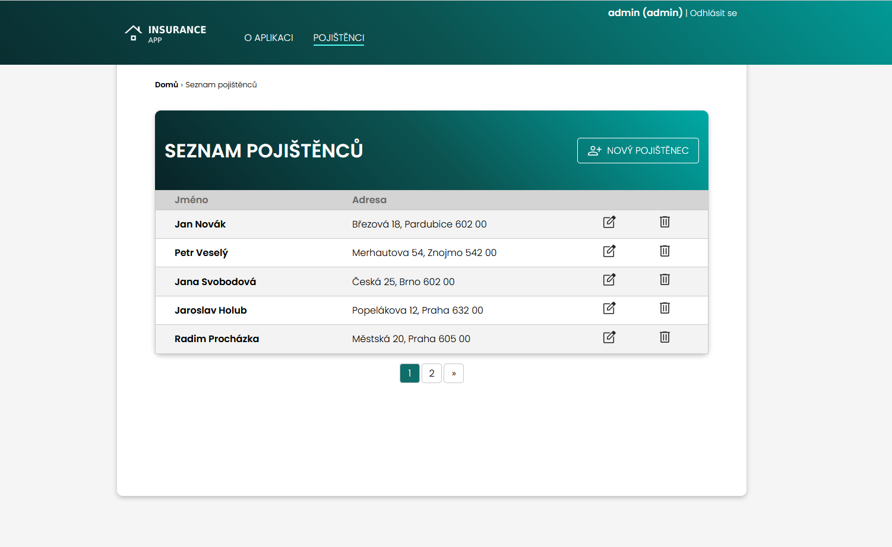

# Django insurance app

Simple portfolio project, that shows basic usage of function based CRUD operations, user registration and login / logout views.

Interface is in Czech language.




## Installation

1. Install requirements.txt from project root directory with:
    ```sh
    pip install -r requirements.txt
    ```
2. Run program from project root directory with:
    ```sh
    python manage.py runserver
    ```

3. Access localhost in your browser at (http://127.0.0.1:8000/)


## Usage
This app is based on clients and insurance products, that belongs to these clients.

To access list of clients, user has to register. Within registration page, there is option to register as admin, which is recommended for the ability to create new clients, edit and delete any clients. Same with insurance products, that belongs to these clients.

Registered users without admin rights can only browse list of clients and clients detail.